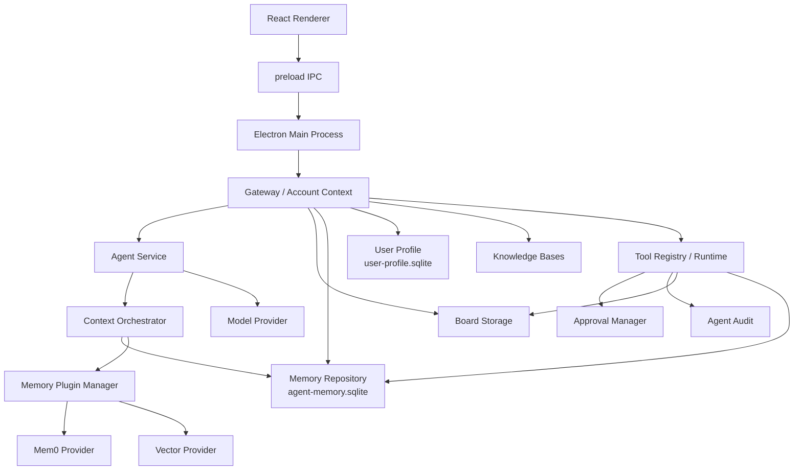
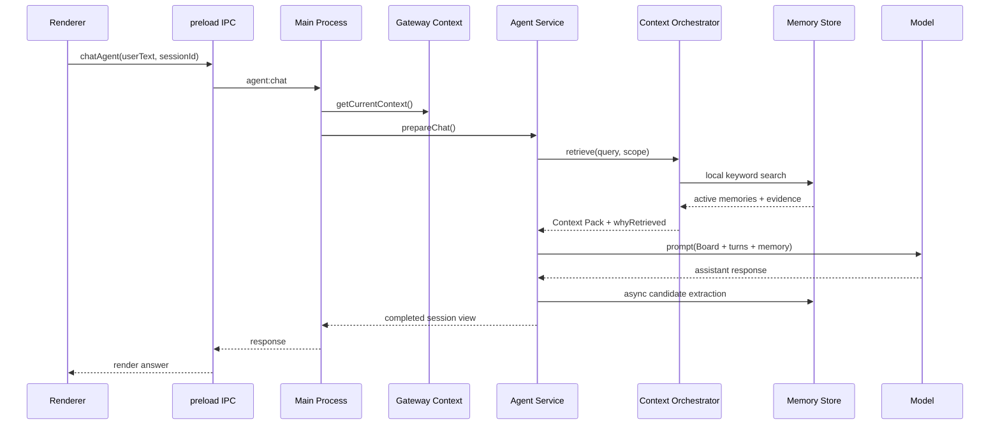
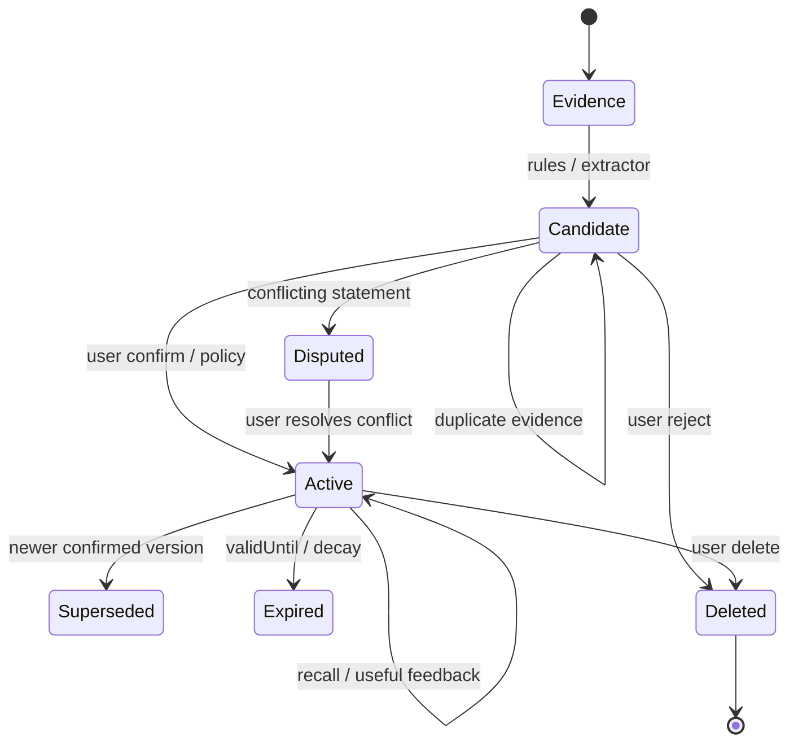
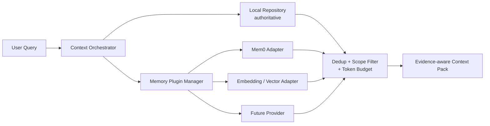
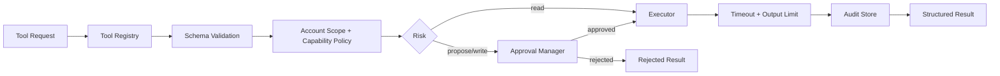
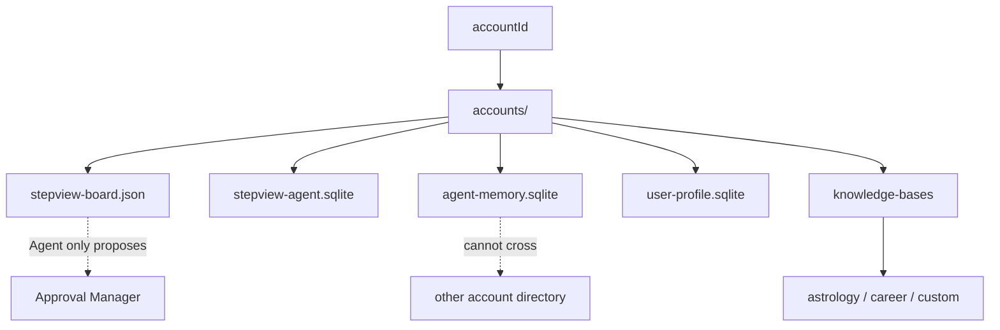

# StepView 架构与扩展开发报告

更新时间：2026-08-24

## 1. 当前状态

StepView 当前是 Electron + React/Vite 应用。主进程负责 Gateway、账号上下文、Board 文件、Agent 会话、记忆仓库和工具权限；Renderer 只通过 preload 暴露的 IPC API 访问这些能力。

核心原则：

- Board 是用户画布事实来源，Agent 只能通过提案请求修改。
- `agent-memory.sqlite` 是可审计的对话记忆仓库，不等于 Board 快照。
- Mem0、向量模型和其他外部服务只能作为可拔插 provider，不能成为唯一事实源。
- 所有账号、Agent、workspace、session 作用域由主进程注入，不能信任 Renderer 或模型传入的账号 ID。
- 记忆默认先是 `candidate`，明确确认后才进入 `active`。

## 2. 项目结构

### 2.1 总体架构图



```text
src/                                      Renderer/UI
  main.jsx                                React 入口和 IPC 消费方
  styles.css                              UI 样式
  agentMemory.js                           从 Board 派生快照和信号
  agentSessionUi.js                        Agent 会话展示状态
  agentTurn.js                             对话 turn 相关前端逻辑

electron/main.js                          Electron 主进程和 IPC 注册
electron/preload.js                        安全暴露给 Renderer 的 API
electron/config.js                         环境变量和运行模式配置
electron/boardStorage.js                   Board 读写和备份
electron/agentService.js                   Agent 会话、Prompt、turn 生命周期
electron/agentSqliteStore.js              会话/turn/window/signal/prompt 日志
electron/agentMemorySqliteStore.js         独立长期记忆数据库

electron/gateway/
  createGateway.js                         Gateway 工厂
  localGateway.js                          Personal/Family 上下文切换和生命周期
  accountContext.js                         单账号依赖装配中心
  accountStore.js                           Family 账号和 session
  networkPolicy.js                          回环/LAN 绑定安全策略

electron/agent/
  memoryPluginManager.js                    可拔插记忆 provider 管理层
  memoryExtractor.js                        规则优先候选抽取
  memoryWriter.js                           去重、冲突和证据写入策略
  contextOrchestrator.js                    本地/插件检索和 Context Pack
  embeddingProvider.js                      embedding provider 扩展边界
  userProfileStore.js                       独立用户画像 SQLite
  knowledgeBaseRegistry.js                 领域知识库模板和 manifest
  toolRegistry.js                           工具注册和发现
  toolRuntime.js                            工具校验、权限、超时和审计
  builtInTools.js                           内置 Board/Memory/Agent 工具
  approvalManager.js                        提案审批队列
  agentAuditStore.js                        审计写入适配器
```

## 3. 一次 Agent 请求的运行链路

### 3.1 Agent 请求时序图



```text
Renderer
  -> preload IPC
  -> electron/main.js
  -> 当前 Gateway Context
  -> agentService.prepareChat
       -> Board memory snapshot
       -> Context Orchestrator
            -> 本地 memory repository
            -> 可选 memory plugins
       -> Mem0 兼容召回
       -> Prompt Builder
  -> Model Provider
  -> agentService.completeChat
       -> 保存 turn/window/signal
       -> 异步 memoryExtractor
            -> memoryWriter
            -> agent-memory.sqlite
```

工具调用链路：

```text
Renderer 或模型请求工具
  -> 主进程 Tool Registry
  -> Tool Runtime
  -> 输入 schema / account scope / capability / approval
  -> 执行并限制输出大小、超时和取消
  -> Audit Store
```

## 4. 记忆系统分层

### 4.1 记忆生命周期图



### 4.2 Board 派生层

`src/agentMemory.js` 只负责从当前 Board 派生任务线、支线、节点、日记信号和用户状态快照。它不负责长期记忆 CRUD，不应在这里加入 SQLite、Mem0 或 embedding 逻辑。

### 4.3 长期记忆仓库

`electron/agentMemorySqliteStore.js` 保存：

- memory item
- evidence
- relation
- feedback
- embedding metadata

常用 API：

```js
const memory = repository.upsert(candidate);
repository.addEvidence(memory.id, evidence);
repository.search("简短回复", { status: "active", limit: 10 });
repository.feedback(memory.id, "confirm");
repository.relate(fromId, toId, "contradicts");
repository.remove(memory.id);
```

### 4.4 写入策略层

`memoryExtractor` 负责从明确用户表达生成候选；`memoryWriter` 负责：

- 同主题同陈述合并证据
- 同主题不同陈述保留双方并建立冲突关系
- 不静默覆盖旧记忆
- 默认保持 candidate

不要在 `agentService` 中直接写 `memory_items`，必须经过 Repository + Writer。

### 4.5 插件管理层



`memoryPluginManager` 位于本地仓库和外部 provider 之间。Mem0、向量数据库、远程 RAG 服务都应实现：

```js
{
  id: "mem0",
  version: "1.0.0",
  capabilities: ["search"],
  enabled: (context) => true,
  search: async (query, context, options) => [],
  close: async () => {},
}
```

插件只返回候选结果，不能绕过账号 scope 直接修改本地仓库。

## 5. 新增记忆能力的标准流程

1. 先定义分类、作用域、敏感等级、证据要求和删除语义。
2. 在 `memoryExtractor.js` 增加结构化候选抽取，输出版本化对象。
3. 在 `memoryWriter.js` 增加去重、冲突和升级策略。
4. 通过 `memoryRepository` 写入，不直接操作 SQLite。
5. 在 `contextOrchestrator.js` 增加召回策略或过滤规则。
6. 如果需要外部服务，实现独立 provider 并注册到 `memoryPluginManager`。
7. 补充 account scope、删除、冲突、证据和失败隔离测试。

候选协议示例：

```js
{
  category: "preference",
  scopeType: "user",
  subjectKey: "response_style",
  statement: "用户偏好简短直接的回复",
  normalizedValue: { style: "concise" },
  sourceType: "explicit",
  sourceRef: "turn-123",
  confidence: 0.86,
  sensitivity: "normal",
  status: "candidate",
  extractionVersion: "rules-1"
}
```

## 6. 新增工具能力的标准流程

### 6.1 工具执行与审批图



只读工具：

```js
registry.register({
  id: "board.search",
  version: "1.0.0",
  risk: "read",
  scopes: ["board:read"],
  inputSchema: { type: "object", required: ["query"] },
  execute: async (input, context) => {},
});
```

开发要求：

- 只使用 Runtime 注入的 `context`。
- 不读取任意文件路径、环境变量或其他账号目录。
- 不接受 Renderer 传入的 accountId 作为权威身份。
- 写入 Board 或敏感记忆时返回 proposal，不直接执行。
- 高风险工具必须经过 Approval Manager。
- 结果要限制大小，支持超时和取消，并产生 audit event。

提案工具不能直接调用 `boardStorage.writeBoard`。审批后的实际写入应另设明确的执行器，并在执行前重新检查当前账号和 Board 版本。

## 7. 数据隔离和目录约定

### 7.1 账号数据隔离图



```text
userData/
  accounts/<account-id>/
    stepview-board.json
    stepview-agent.sqlite
    agent-memory.sqlite
    user-profile.sqlite
    knowledge-bases/<knowledge-base-id>/
      manifest.json
```

Personal 模式使用固定本地账号 `local-personal`；Family 模式使用 Gateway 登录账号。账号切换时必须关闭旧 context，再创建新的 Board、Agent、Memory、Plugin 和 Tool 依赖。

## 8. 当前已知限制

- `userProfileStore` 和 `knowledgeBaseRegistry` 已有基础存储/模板能力，但尚未接入完整 UI。
- 关键词检索已可用；向量检索和 reranker 仍通过 provider 边界预留。
- 家庭 LAN HTTP 服务目前没有开放完整的 CIDR、CSRF、限流服务面；默认仍以 Electron IPC/回环为主。
- Agent SQLite 通过账号独立数据库实现隔离，旧表尚未做字段级 accountId 迁移。
- 正式 Recall@K、Precision@K 和 Prompt Injection 评测集尚未建立。

## 9. 推荐扩展顺序

新增普通记忆能力：`Extractor -> Writer -> Repository -> Orchestrator -> UI`。

新增外部记忆后端：`Provider -> Plugin Manager -> Orchestrator`，不要修改 `agentService` 的核心流程。

新增工具：`Manifest -> Registry -> Runtime -> Approval（如需） -> IPC/UI`。

新增领域工作区：创建独立 knowledge base、schema、source/ingestion policy 和 domain tools，不要把领域知识混入通用用户记忆表。
