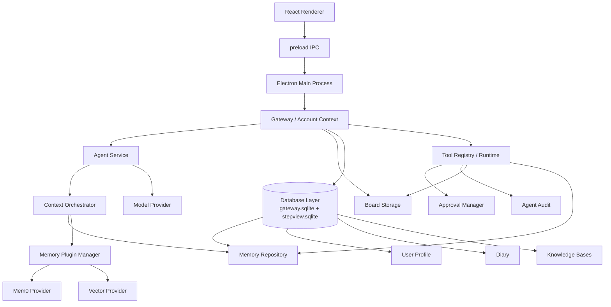
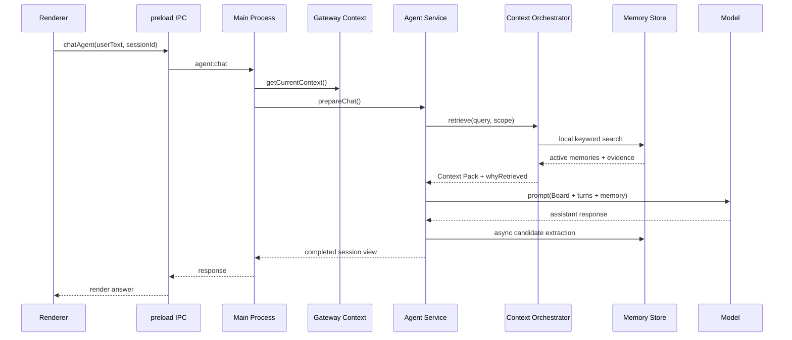
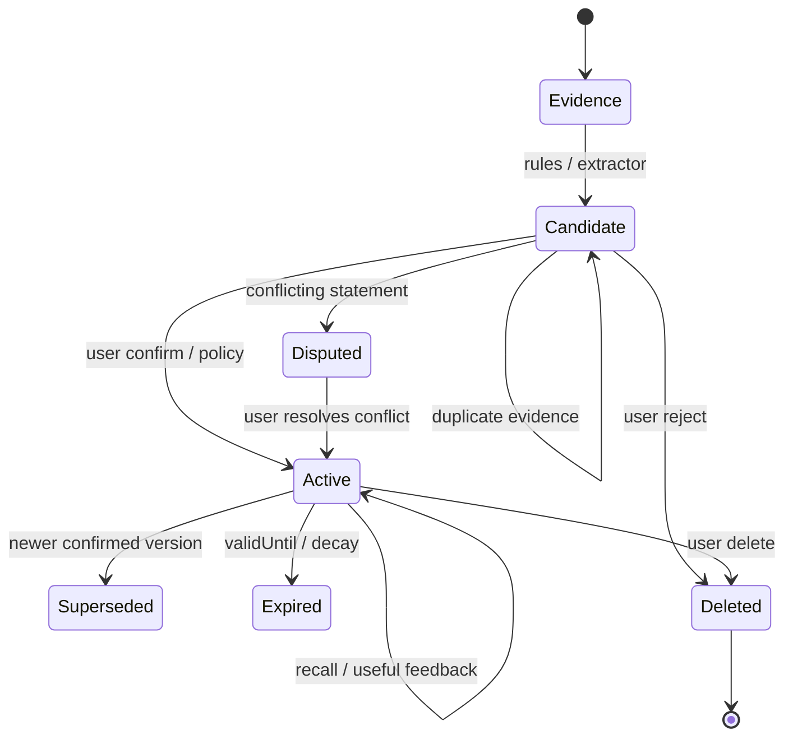
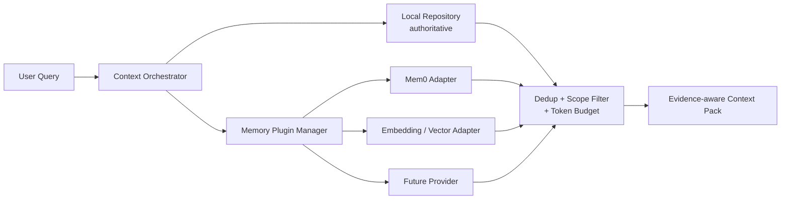
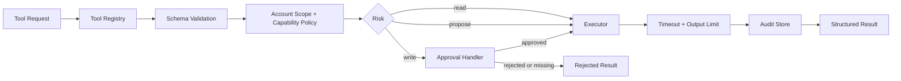
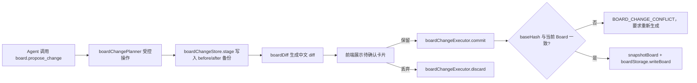
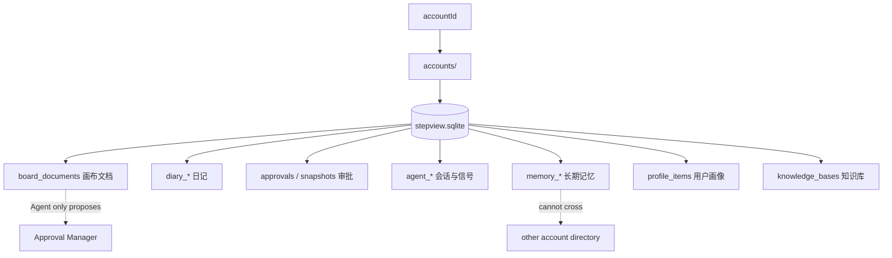

# StepView 架构与扩展开发报告

更新时间：2026-09-24

## 1. 当前状态

StepView 当前是 Electron + React/Vite 应用。主进程负责 Gateway、账号上下文、Board 文件、Agent 会话、记忆仓库和工具权限；Renderer 只通过 preload 暴露的 IPC API 访问这些能力。

家庭网页端当前以 Docker Compose 为主运行面：`web` 提供静态前端，`gateway` 提供账号、Board 与 Agent HTTP/SSE API，`redis` 提供缓存。Gateway 与 Redis 只通过项目内部网络通信；账号与 SQLite 数据挂载到 `.stepview-family-data`，Redis AOF 挂载到 `.stepview-runtime/redis`。

核心原则：

- Board 是用户画布事实来源，Agent 只能通过提案请求修改。
- 需要持久化的数据只有一个入口：数据库层（`electron/db/`）。业务代码调仓储，不关心数据存在哪、怎么存。
- 长期记忆是可审计的仓库（`memory_*` 表），不等于 Board 快照。
- Mem0、向量模型和其他外部服务只能作为可拔插 provider，不能成为唯一事实源。
- 所有账号、Agent、workspace、session 作用域由主进程注入，不能信任 Renderer 或模型传入的账号 ID。
- 记忆默认先是 `candidate`，明确确认后才进入 `active`。

## 2. 项目结构

### 2.1 总体架构图


```mermaid
flowchart TB
    UI[React Renderer] --> IPC[preload IPC]
    IPC --> MAIN[Electron Main Process]
    MAIN --> GW[Gateway / Account Context]
    GW --> AS[Agent Service]
    GW --> BOARD[Board Storage]
    GW --> DB[(Database Layer\ngateway.sqlite + stepview.sqlite)]
    DB --> MEM[Memory Repository]
    DB --> PROFILE[User Profile]
    DB --> DIARY[Diary]
    DB --> KB[Knowledge Bases]
    AS --> ORCH[Context Orchestrator]
    ORCH --> MEM
    ORCH --> PLUG[Memory Plugin Manager]
    PLUG --> MEM0[Mem0 Provider]
    PLUG --> VEC[Vector Provider]
    AS --> MODEL[Model Provider]
    GW --> TOOLS[Tool Registry / Runtime]
    TOOLS --> APPROVAL[Approval Manager]
    TOOLS --> AUDIT[Agent Audit]
    TOOLS --> BOARD
    TOOLS --> MEM
```

```text
src/                                      Renderer/UI
  main.jsx                                React 入口和 IPC 消费方
  styles.css                              UI 样式
  agentMemory.js                           从 Board 派生快照和信号
  agentSessionUi.js                        Agent 会话展示状态
  agentTurn.js                             对话 turn 相关前端逻辑

electron/main.js                          Electron 主进程和 IPC 注册
electron/preload.js                        安全暴露给 Renderer 的 API
electron/config.js                         环境变量和运行模式配置
electron/boardStorage.js                   Board 存储的薄适配器（读写都走仓储）
electron/diaryService.js                   日记业务层（两种类型、校验、回收站、节点备注非破坏导入）
electron/agentService.js                   Agent 会话、Prompt、turn 生命周期

electron/db/                               数据库层：唯一的数据入口
  index.js                                   openAccountDatabase() / openGlobalDatabase()
  connection.js                              DatabaseSync 封装：PRAGMA、withTransaction
  migrations/                                顺序迁移注册表与 .sql
  repositories/                              每个领域一个仓储
  retention.js                               所有 TTL 与清理规则的唯一定义处
  maintenance.js                             启动一次 + 每天一次的清理调度
  backup.js                                  VACUUM INTO 轮转备份
  archive.js                                 统一的导出、校验与恢复
  boardExport.js                             画布 JSON 镜像（过渡用，Phase 7 之后移除）
  boardHash.js                               画布指纹，审批冲突检测
  legacyImport.js                            旧文件的一次性导入（幂等）

electron/gateway/
  createGateway.js                         Gateway 工厂
  localGateway.js                          Personal/Family 上下文切换和生命周期
  accountContext.js                         单账号依赖装配中心
  accountStore.js                           Family 账号和 session
  networkPolicy.js                          回环/LAN 绑定安全策略

electron/agent/
  memoryPluginManager.js                    可拔插记忆 provider 管理层
  memoryExtractor.js                        规则优先候选抽取
  memoryWriter.js                           去重、冲突和证据写入策略
  contextOrchestrator.js                    本地/插件检索和 Context Pack
  embeddingProvider.js                      embedding provider 扩展边界
  knowledgeBaseRegistry.js                 领域知识库模板和 manifest
  toolRegistry.js                           工具注册和发现
  toolRuntime.js                            工具校验、权限、超时和审计
  builtInTools.js                           内置 Board/Memory/Agent 工具
  toolSchema.js                             工具定义规范化和 input schema 校验
  toolBridge.js                             各 Gateway 共用的工具上下文和 OpenAI schema 适配
  tools/                                    统一工具清单（board / diary / memory / agent 四组）
  approvalManager.js                        提案审批队列
  approvalService.js                        记忆、画布与日记提案的统一审批入口
  boardChangePlanner.js                     Board 变更操作（受控枚举，复用 progressCore）
  boardDiff.js                              变更 diff 和中文摘要
  boardChangeStore.js                       提案暂存、备份快照和保留策略（表，不扫目录）
  boardChangeExecutor.js                    审批通过后的落盘执行器和版本校验
  agentAuditStore.js                        审计写入适配器
```

### 2.2 数据库层（唯一的数据入口）

这一层解决的是"数据到底存在哪"没人说得清的问题。以前账号、画布、Agent 会话、长期记忆、画像、知识库、审批队列散在 14 处：整文件 JSON、一个提案一个文件、三个 SQLite、Redis、localStorage，还有重启就丢的内存 Map。

**目录与职责**

```text
electron/db/
  index.js                  openAccountDatabase() / openGlobalDatabase()
  connection.js             DatabaseSync 封装：PRAGMA、withTransaction、连接生命周期
  migrations/               顺序迁移注册表与 .sql（只能追加，不能修改已发布的文件）
  repositories/             每个领域一个仓储：account / board / diary / approval /
                            agentSession / agentMemory / userProfile / knowledgeBase
  retention.js              全部 TTL 与定期清理的唯一定义处
  maintenance.js            启动跑一次 + 每天一次的清理调度
  backup.js                 VACUUM INTO 轮转备份
  archive.js                统一的导出、校验与恢复
  boardExport.js            画布 JSON 镜像（过渡用，Phase 7 之后移除）
  boardHash.js              画布指纹，审批冲突检测用
  legacyImport.js           旧文件的一次性导入，幂等
  transfer.js               个人数据导入家庭账号时的只读搬运
```

**边界规则**

1. `node:sqlite` 只允许出现在 `electron/db/` 里，其他模块一律通过仓储读写。
2. 业务代码不直接碰数据文件；`electron/db/` 之外的文件写入受边界测试限制。
3. 过期与删除只在 `electron/db/retention.js` 定义，别处不许写 TTL。
4. 迁移必须幂等、失败可重试；`schema_migrations` 记录每一步的版本与 SQL 校验和，改动已发布的迁移会被直接拒绝。
5. 这些规则由 `tests/dbBoundary.test.js` 扫描源码强制执行，豁免名单只减不增——目前只剩两条永久豁免（`preflight.js`、`redisManager.js`）。

**两个数据库**

| 库 | 文件 | 内容 |
| --- | --- | --- |
| 全局库 | `gateway.sqlite` | 账号、登录会话、全局设置、它自己的清理记录 |
| 账号库 | `stepview.sqlite` | 画布文档、日记、审批与快照、Agent 会话与信号、长期记忆、用户画像、知识库 |

个人模式的数据目录就是数据目录本身；家庭模式每个账号一个 `accounts/<account-id>/stepview.sqlite`。两个库各有一份 `schema_migrations`，互不影响。

**保留策略（一张表）**

| 数据 | 规则 |
| --- | --- |
| 登录会话 | 过期即删 |
| 已完成的 Agent 轮次 | **不清理**——那是用户自己的对话历史 |
| 半截（`status = 'pending'`）的轮次 | 超过 2 天删除 |
| Agent 信号 / 提示词快照 / Mem0 同步日志 | 天数与条数上限，见 `RETENTION_RULES` |
| 画布变更提案与快照 | 7 天 / 上限 20 |
| 回收站里的日记 | 30 天后物理删除 |
| 日记变更日志 | 180 天且最多 500 条 |

每条规则单独一个用例：只删该删的；刚好压在 TTL 上的记录不删；重跑不误删；每次执行的统计写进 `retention_runs`。

### 2.3 日记子系统（每日日记 / 节点日记）

日记是**两块界面共用一套数据**：日记板块（独立视图）和节点展开区里的原生日记。

**两种类型不是一个开关，是数据本身的属性**

| `kind` | 节点关联数 | 出现在哪里 |
| --- | --- | --- |
| `daily` | 0..n | 日记板块主视图（按天）、节点上的日期按钮排 |
| `node` | **≥1** | 节点展开区的"原生日记"列表 |

类型显式存进 `diary_entries.kind`，不靠"有没有挂节点"推导：一条不挂节点的可能是每日日记，
一条挂着节点的也可能是每日日记，推导必然出错。

"节点日记必须挂节点"这条不变量有三道防线，缺一不可：

1. `src/diaryCore.js` 的 `normalizeDiaryInput`——前端和主进程共用的纯函数，界面在提交前就能提示；
2. 仓储在**同一个事务**里写完关联后再校验一次，不满足就整体回滚（SQLite 跨不了表做 `CHECK`，
   触发器也做不了延迟校验，只能这样）；
3. 一条全库不变量测试：扫描整张表，不允许存在 `kind='node'` 却零 node 关联的条目。

**节点被删掉时不删日记**

`diary_links` 只打 `orphaned_at`，条目和正文一个字都不动——日记是用户写的东西，
不该因为他在画布上整理结构就跟着消失。标记的触发点在 `electron/boardStorage.js`：
画布保存时对比节点集合，把消失的节点通过 `onNodesRemoved` 回调报给 `diaryService.markNodesOrphaned`。
放在保存这一个入口上，删节点 / 删任务 / 清空看板 / Agent 审批四条路径就都覆盖到了；
回调抛错只记日志，不影响画布保存本身。

**画布备注导入是非破坏的**

`previewNodeNoteImport` / `importNodeNotes` 两条硬规则：**必须先 `confirm`**（否则只回预览），
**画布上 `node.detail` 一个字都不动**。幂等靠 `kv` 表里的导入标记（`diary-import:node-notes:<accountId>`），
不是靠查有没有导入过的条目——用户把导入出来的日记删掉之后，不该再自动长回来。
两个方法都收一个可选的 `nodeIds`：节点面板上的入口只导那一个节点，
不传时行为不变（迁移和批量的老路径照旧）。

**前端边界**

`src/diary/` 是这一块的组件目录，`main.jsx` 只留视图切换和与画布的联动：

```
src/diary/
  diariesView.jsx       日记板块（按天 / 时间线 / 搜索 / 标签 / 回收站）
  diaryEditor.jsx       新建 / 编辑表单（kind 不作为界面字段暴露）
  nodeDiarySection.jsx  节点里的"原生日记 + 日期按钮排 + 画布备注导入"
  dayDiaryPopover.jsx   点日期按钮弹出的当日弹层
  diaryApi.js           统一数据入口：Electron 走 IPC，家庭模式走 HTTP
  diaryViewCore.js      纯函数：按天分组、日期去重、chip 文案、弹层定位（可单测）
```

两个容易踩的坑，改动这一块之前先看一眼：

- **节点卡片里的弹层必须 `createPortal` 挂到 `document.body`**。`.node` 上有 `transform` 和
  `backdrop-filter`，这两个属性都会给 `position: fixed` 的后代造包含块，
  于是 `.modalBackdrop` 会缩成节点卡片那么大（实测 208x448），弹窗直接溢出去、位置还跟着画布缩放跑。
- **画布的鼠标/键盘处理要放行这一块**：`isCanvasPanTarget` 白名单里有 `.diaryPopover` / `.diaryBackdrop`；
  键盘监听在弹层开着或画布不在前台时不响应 `Delete` / `Backspace`。少一处就会出现"点一下弹层把画布拖走了"。

**Agent 这条路**

Agent 碰不到日记表：写作只能走 `diary.propose_entry` 生成提案进统一审批队列，用户批准才落库；
读取走 `diary.recent`（`diaryService.timeline`，两种类型都在里面，所以每条都带 `kind`）。
提案的 `kind` 会一路带到落库那一刻，摘要和 diff 用的是"每日日记 / 节点日记"这种说法，
不把 `daily` / `node` 这两个内部词摆给用户看。

**注意 `src/agentMemory.js` 里的 `diarySignals` 不是日记条目**。它读的是 `node.detail`（画布备注），
`diaryEntryId` 里装的其实是 node id；日记的 `kind` 在这条链路上不适用。
真正的日记条目只经上面那两个工具进 Agent。

**内存态三分类**

判断方法只有一句话：问"进程重启之后，用户会不会发现少了东西"。

- **可以丢的缓存**：Redis 提示词/窗口状态、账号上下文 LRU。丢了会重新算，不影响正确性。
- **必须落库的状态**：审批队列、画布提案与快照、会话窗口、导入标记（`kv` 表）。重启后必须还在，所以一律进表。
- **只活在一次调用里的对象**：请求体、工具上下文、渲染中间结果。出栈即弃，不进任何存储。

**备份与恢复**

`data:export-archive` 把每个存在的库各自 `VACUUM INTO` 成一致快照（复制正在写入的数据库文件会得到半截副本，`VACUUM INTO` 不会），并附一份 manifest：格式版本、程序版本、每个库的 schema 版本、表清单与行数。个人模式没有全局库文件，少它一份不算错误（但会在结果里如实写出来）；该有而没有的库一定报错，否则用户会拿到一份看着正常、其实缺数据的备份。

恢复的顺序是"先校验、再替换"，绝不会先替换再祈祷：manifest 是否合法、`PRAGMA integrity_check` 是否通过、schema 版本是否和清单一致且不比当前程序新、必要表是否齐全——全部通过才动文件。

"必要表"只要求能认出"这是 StepView 的这个库"的那几张（账号库是 `schema_migrations` / `kv` / `board_documents`）。故意不列全：老备份是按当年的 schema 导出的，天然没有后来才加的表，把新表列成必需会让三个月前的备份直接变成不可恢复——而它其实只要打开时补跑迁移就能用。比当前代码新的备份才会被拒绝。校验全程只读，不会给用户的备份留下任何改动。替换时当前两个库改名成 `*.pre-restore-<时间>` 保留（不删除），旧库的 `-wal` / `-shm` 一并清掉（残留的 WAL 套在新文件上会把新库读坏）。

## 3. 一次 Agent 请求的运行链路

### 3.1 Agent 请求时序图


```mermaid
sequenceDiagram
    participant R as Renderer
    participant P as preload IPC
    participant M as Main Process
    participant G as Gateway Context
    participant A as Agent Service
    participant O as Context Orchestrator
    participant S as Memory Store
    participant L as Model

    R->>P: chatAgent(userText, sessionId)
    P->>M: agent:chat
    M->>G: getCurrentContext()
    M->>A: prepareChat()
    A->>O: retrieve(query, scope)
    O->>S: local keyword search
    S-->>O: active memories + evidence
    O-->>A: Context Pack + whyRetrieved
    A->>L: prompt(Board + turns + memory)
    L-->>A: assistant response
    A->>S: async candidate extraction
    A-->>M: completed session view
    M-->>P: response
    P-->>R: render answer
```

```text
Renderer
  -> preload IPC
  -> electron/main.js
  -> 当前 Gateway Context
  -> agentService.prepareChat
       -> Board memory snapshot
       -> Context Orchestrator
            -> 本地 memory repository
            -> 可选 memory plugins
       -> Mem0 兼容召回
       -> Prompt Builder
  -> Model Provider
  -> agentService.completeChat
       -> 保存 turn/window/signal
       -> 异步 memoryExtractor
            -> memoryWriter
            -> agent-memory.sqlite
```

工具调用链路：

```text
Renderer 或模型请求工具
  -> 主进程 Tool Registry
  -> Tool Runtime
  -> 输入 schema / account scope / capability / approval
  -> 执行并限制输出大小、超时和取消
  -> Audit Store
```

工具风险等级统一为三档，`toolRuntime` 按等级决定是否放行：

| risk | 含义 | 执行期审批 |
| --- | --- | --- |
| `read` | 只读，无副作用 | 不需要 |
| `propose` | 只写暂存区，不碰线上用户数据 | 不需要（用户在对提案的审批环节确认） |
| `write` | 直接改动线上用户数据 | 必须配置 approval handler，否则一律拒绝 |

审计写入失败不会影响工具结果：`toolRuntime` 会吞掉 audit sink 的异常并记日志。
超时通过 `AbortController` 真正中断等待，而不是仅仅标记状态。

## 4. 记忆系统分层

### 4.1 记忆生命周期图


```mermaid
stateDiagram-v2
    [*] --> Evidence
    Evidence --> Candidate: rules / extractor
    Candidate --> Candidate: duplicate evidence
    Candidate --> Active: user confirm / policy
    Candidate --> Disputed: conflicting statement
    Active --> Active: recall / useful feedback
    Active --> Superseded: newer confirmed version
    Active --> Expired: validUntil / decay
    Candidate --> Deleted: user reject
    Active --> Deleted: user delete
    Disputed --> Active: user resolves conflict
    Deleted --> [*]
```

### 4.2 Board 派生层

`src/agentMemory.js` 只负责从当前 Board 派生任务线、支线、节点、日记信号和用户状态快照。它不负责长期记忆 CRUD，不应在这里加入 SQLite、Mem0 或 embedding 逻辑。

这里的 `diarySignals` **名不副实**：它从 `node.detail`（画布备注）派生，和 `diary_entries` 里的日记条目无关，
`diaryEntryId` 装的其实是 node id。日记的 `kind` 在这条链路上不适用，别往这里加类型字段——
真正的日记条目走 `diaryService`（见 2.3）。

### 4.3 长期记忆仓库

`electron/agentMemorySqliteStore.js` 保存：

- memory item
- evidence
- relation
- feedback
- embedding metadata

常用 API：

```js
const memory = repository.upsert(candidate);
repository.addEvidence(memory.id, evidence);
repository.search("简短回复", { status: "active", limit: 10 });
repository.feedback(memory.id, "confirm");
repository.relate(fromId, toId, "contradicts");
repository.remove(memory.id);
```

### 4.4 写入策略层

`memoryExtractor` 负责从明确用户表达生成候选；`memoryWriter` 负责：

- 同主题同陈述合并证据
- 同主题不同陈述保留双方并建立冲突关系
- 不静默覆盖旧记忆
- 默认保持 candidate

不要在 `agentService` 中直接写 `memory_items`，必须经过 Repository + Writer。

### 4.5 插件管理层


```mermaid
flowchart LR
    Q[User Query] --> O[Context Orchestrator]
    O --> LOCAL[Local Repository\nauthoritative]
    O --> PM[Memory Plugin Manager]
    PM --> P1[Mem0 Adapter]
    PM --> P2[Embedding / Vector Adapter]
    PM --> P3[Future Provider]
    LOCAL --> PACK[Dedup + Scope Filter\n+ Token Budget]
    P1 --> PACK
    P2 --> PACK
    P3 --> PACK
    PACK --> CTX[Evidence-aware Context Pack]
```

`memoryPluginManager` 位于本地仓库和外部 provider 之间。Mem0、向量数据库、远程 RAG 服务都应实现：

```js
{
  id: "mem0",
  version: "1.0.0",
  capabilities: ["search"],
  enabled: (context) => true,
  search: async (query, context, options) => [],
  close: async () => {},
}
```

插件只返回候选结果，不能绕过账号 scope 直接修改本地仓库。

## 5. 新增记忆能力的标准流程

1. 先定义分类、作用域、敏感等级、证据要求和删除语义。
2. 在 `memoryExtractor.js` 增加结构化候选抽取，输出版本化对象。
3. 在 `memoryWriter.js` 增加去重、冲突和升级策略。
4. 通过 `memoryRepository` 写入，不直接操作 SQLite。
5. 在 `contextOrchestrator.js` 增加召回策略或过滤规则。
6. 如果需要外部服务，实现独立 provider 并注册到 `memoryPluginManager`。
7. 补充 account scope、删除、冲突、证据和失败隔离测试。

候选协议示例：

```js
{
  category: "preference",
  scopeType: "user",
  subjectKey: "response_style",
  statement: "用户偏好简短直接的回复",
  normalizedValue: { style: "concise" },
  sourceType: "explicit",
  sourceRef: "turn-123",
  confidence: 0.86,
  sensitivity: "normal",
  status: "candidate",
  extractionVersion: "rules-1"
}
```

## 6. 新增工具能力的标准流程

### 6.1 工具执行与审批图


```mermaid
flowchart LR
    REQ[Tool Request] --> REG[Tool Registry]
    REG --> VALID[Schema Validation]
    VALID --> POLICY[Account Scope + Capability Policy]
    POLICY --> RISK{Risk}
    RISK -->|read| EXEC[Executor]
    RISK -->|propose| EXEC
    RISK -->|write| GATE[Approval Handler]
    GATE -->|approved| EXEC
    GATE -->|rejected or missing| DENY[Rejected Result]
    EXEC --> LIMIT[Timeout + Output Limit]
    LIMIT --> AUDIT[Audit Store]
    AUDIT --> RESULT[Structured Result]
```

内置工具集中在 `electron/agent/tools/`，按 `board / memory / agent` 分组，由 `builtInTools.js` 统一注册。
新增工具使用 `defineTool` 声明，注册时就会校验 id 命名、risk、scopes、title 和 input schema，重复 id 或非法定义会直接失败。

```js
import { defineTool } from "./defineTool.js";

export const boardTools = [defineTool({
  id: "board.search",
  title: "Search board",
  description: "Search the user's board for task lines and nodes matching a keyword.",
  category: "board",
  version: "1.0.0",
  risk: "read",
  scopes: ["board:read"],
  inputSchema: { type: "object", additionalProperties: false, required: ["query"], properties: { query: { type: "string", minLength: 1, maxLength: 200 } } },
  execute: async (input, context) => {},
})];
```

开发要求：

- 只使用 Runtime 注入的 `context`。
- 不读取任意文件路径、环境变量或其他账号目录。
- 不接受 Renderer 传入的 accountId 作为权威身份。
- 写入 Board 或敏感记忆时返回 proposal，不直接执行。
- 高风险工具必须经过 Approval Manager。
- 结果要限制大小，支持超时和取消，并产生 audit event。
- `risk: "write"` 的工具必须显式配置 approval handler，否则 Runtime 默认拒绝执行。

提案工具不能直接调用 `boardStorage.writeBoard`。审批后的实际写入应另设明确的执行器，并在执行前重新检查当前账号和 Board 版本。

### 6.2 Board 变更的备份、diff 和确认流程

`board.propose_change` 是唯一面向模型的 Board 写入口，风险等级为 `propose`：它只写暂存区，不碰线上画布。


```mermaid
flowchart LR
    AGENT[Agent 调用 board.propose_change] --> PLAN[boardChangePlanner 受控操作]
    PLAN --> SNAPSHOT[boardChangeStore.stage 写入 before/after 备份]
    SNAPSHOT --> DIFF[boardDiff 生成中文 diff]
    DIFF --> REVIEW[前端展示待确认卡片]
    REVIEW -->|保留| COMMIT[boardChangeExecutor.commit]
    REVIEW -->|丢弃| DISCARD[boardChangeExecutor.discard]
    COMMIT --> HASH{baseHash 与当前 Board 一致?}
    HASH -->|否| CONFLICT[BOARD_CHANGE_CONFLICT，要求重新生成]
    HASH -->|是| WRITE[snapshotBoard + boardStorage.writeBoard]
```

- 支持的操作是受控枚举（`task.*` / `node.*` / `sticker.*`），全部复用 `src/progressCore.js` 的既有函数，保证 Agent 写入与 UI 写入的结构完全一致。
- 提案存在账号库的 `approvals` / `snapshots` 表里，内含原始 Board 备份、候选 Board、`baseHash` 和 diff。以前是一个提案一个 JSON 文件、列个表要扫目录，现在一次查询就够。
- 审批通过时 `boardChangeExecutor` 会重新读取当前 Board 并比对 `baseHash`。不一致说明期间有别的写入，直接拒绝，不会覆盖用户的新数据。
- 落盘前的快照写进 `snapshots` 表；画布镜像 `stepview-board.json` 由数据库层维护，`boardStorage` 自身滚动更新镜像的上一版。
- 待确认提案落库，重启后依然会出现在审批列表里，不会因为进程退出而丢失或多写。
- 同一套审批队列还承载记忆提案和日记提案（`diary_change`）。Agent 想写日记也只能生成提案，用户批准后才落库。

## 7. 数据隔离和目录约定

### 7.1 账号数据隔离图


```mermaid
flowchart TD
    ACCOUNT[accountId] --> DIR[accounts/<account-id>]
    DIR --> DB[(stepview.sqlite)]
    DB --> BOARD[board_documents 画布文档]
    DB --> DIARY[diary_* 日记]
    DB --> APPROVAL[approvals / snapshots 审批]
    DB --> SESSION[agent_* 会话与信号]
    DB --> MEMORY[memory_* 长期记忆]
    DB --> PROFILE[profile_items 用户画像]
    DB --> KBS[knowledge_bases 知识库]
    MEMORY -. cannot cross .-> OTHER[other account directory]
    BOARD -. Agent only proposes .-> APPROVE[Approval Manager]
```

```text
userData/
  gateway.sqlite                 全局库：账号、登录会话、全局设置
  accounts/<account-id>/
    stepview.sqlite              账号库：画布、日记、审批、Agent、记忆、画像、知识库
    stepview-board.json          画布 JSON 镜像（过渡用，Phase 7 之后移除）
    stepview-board.backup.json   镜像的上一版
  backups/                       VACUUM INTO 轮转备份
  stepview-backup-<时间>/         显式导出的一份完整快照（manifest.json + 两个库）
```

Personal 模式使用固定本地账号 `local-personal`；Family 模式使用 Gateway 登录账号。账号切换时必须关闭旧 context，再创建新的 Board、Agent、Memory、Plugin 和 Tool 依赖。

## 8. 当前已知限制

- 用户画像和知识库已有仓储能力，但尚未接入完整 UI。
- 关键词检索已可用；向量检索和 reranker 仍通过 provider 边界预留。日记的中文检索走混合策略：三字及以上用 FTS5 的 trigram，少于三字回退 `LIKE`（trigram 对两字查询无解）。
- 家庭版已提供带 Bearer session 的 HTTP Gateway；默认绑定回环地址，LAN 模式仍需继续补充 CIDR 白名单和限流。
- 账号库通过"每账号一个文件"实现隔离，旧的 Agent 表没有 `account_id` 列（文件即边界），没有强行加。
- 已软删除的记忆还没有物理清理规则：它会级联到三张子表，需要单独评审，暂时按"不删"处理。
- 画布多标签页同时编辑仍是后写覆盖先写；要修得在保存时做乐观并发校验并配前端冲突提示（见 Phase 7 说明）。
- 正式 Recall@K、Precision@K 和 Prompt Injection 评测集尚未建立。
- 日记这块的**桌面模式界面只有人工验收**：容器里的 `Dockerfile` 设了 `ELECTRON_SKIP_BINARY_DOWNLOAD=1`，
  只有 gateway + web，没有 Electron 运行时；家庭模式那条路已经用无头 Chrome 驱动真实界面跑通了。

## 9. 推荐扩展顺序

新增普通记忆能力：`Extractor -> Writer -> Repository -> Orchestrator -> UI`。

新增外部记忆后端：`Provider -> Plugin Manager -> Orchestrator`，不要修改 `agentService` 的核心流程。

新增工具：`defineTool（tools/<domain>Tools.js） -> Registry -> Runtime -> Approval（如需） -> IPC/UI`。
新增需要持久化的数据：先在 `electron/db/migrations/` 加一条迁移，再写仓储，最后才让业务层调用——不要绕开数据库层直接写文件或开库。

新增领域工作区：创建独立 knowledge base、schema、source/ingestion policy 和 domain tools，不要把领域知识混入通用用户记忆表。
